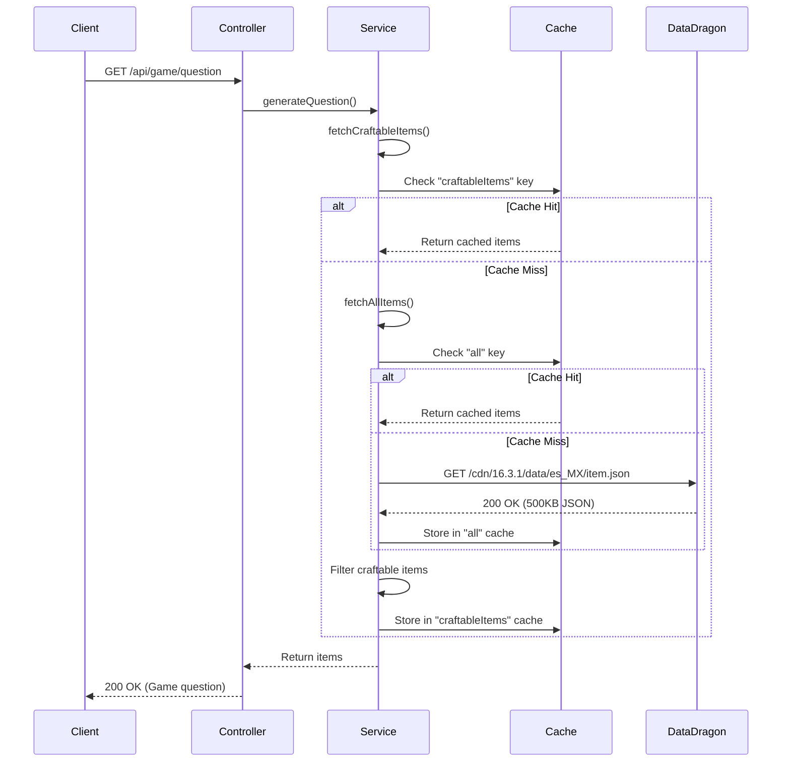

## What is Data Dragon?

**Data Dragon** is Riot Games' official CDN for League of Legends static data and assets. It provides:

- Item data (names, descriptions, stats, recipes)
- Champion information
- Runes and summoner spells
- Game assets (images, icons)

<Info>
  Crafter LoL uses Data Dragon to fetch all item information dynamically, ensuring the game stays up-to-date with the latest League of Legends patches.
</Info>

## API Overview

### Base URL

```
https://ddragon.leagueoflegends.com
```

### Key Endpoints

<ParamField path="/api/versions.json" type="GET">
  Returns array of available patch versions.
  
  **Example Response:**
  ```json
  ["16.3.1", "16.2.1", "16.1.1", ...]
  ```
</ParamField>

<ParamField path="/cdn/{version}/data/{language}/item.json" type="GET">
  Returns all items for a specific version and language.
  
  **Example URL:**
  ```
  https://ddragon.leagueoflegends.com/cdn/16.3.1/data/es_MX/item.json
  ```
  
  **Response Size:** ~500KB of JSON data
</ParamField>

<ParamField path="/cdn/{version}/img/item/{imageName}" type="GET">
  Returns item image.
  
  **Example:**
  ```
  https://ddragon.leagueoflegends.com/cdn/16.3.1/img/item/1001.png
  ```
</ParamField>

## Spring WebClient Setup

The application uses **Spring WebFlux's WebClient** for reactive, non-blocking HTTP calls.

### Configuration

From `config/WebClientConfig.java`:

```java
@Configuration
public class WebClientConfig {

    @Value("${ddragon.base.url}")
    private String baseUrl;

    @Value("${webclient.timeout.connect:5000}")
    private int connectTimeout;

    @Value("${webclient.timeout.read:10000}")
    private int readTimeout;

    @Value("${webclient.buffer.size:5242880}")
    private int bufferSize;  // 5 MB for large responses

    @Bean
    public WebClient webClient() {
        // Configure Netty HTTP client with timeouts
        HttpClient httpClient = HttpClient.create()
                .option(ChannelOption.CONNECT_TIMEOUT_MILLIS, connectTimeout)
                .responseTimeout(Duration.ofMillis(readTimeout))
                .doOnConnected(conn ->
                        conn.addHandlerLast(new ReadTimeoutHandler(readTimeout, TimeUnit.MILLISECONDS))
                                .addHandlerLast(new WriteTimeoutHandler(readTimeout, TimeUnit.MILLISECONDS)));

        // Increase buffer size for large Data Dragon responses
        ExchangeStrategies strategies = ExchangeStrategies.builder()
                .codecs(configurer -> configurer.defaultCodecs().maxInMemorySize(bufferSize))
                .build();

        return WebClient.builder()
                .baseUrl(baseUrl)
                .clientConnector(new ReactorClientHttpConnector(httpClient))
                .exchangeStrategies(strategies)
                .build();
    }
}
```

<AccordionGroup>
  <Accordion title="Why Increase Buffer Size?">
    Default Spring WebClient buffer is 256KB. Data Dragon's `item.json` response is ~500KB, which would cause:
    ```
    DataBufferLimitException: Exceeded limit on max bytes to buffer
    ```
    
    Setting `maxInMemorySize` to 5MB (5242880 bytes) prevents this error.
  </Accordion>

  <Accordion title="Connection Timeouts">
    **Connect Timeout (5 seconds):** Maximum time to establish connection
    
    **Read Timeout (10 seconds):** Maximum time to read response data
    
    These values balance reliability with user experience.
  </Accordion>

  <Accordion title="Reactive vs Blocking">
    WebClient is reactive but we use `.block()` to convert to synchronous:
    ```java
    ItemsData itemsData = webClient.get()
        .uri(url)
        .retrieve()
        .bodyToMono(ItemsData.class)
        .block();  // Blocking call
    ```
    
    This is acceptable since:
    - API calls are cached (rarely executed)
    - Game endpoints are not high-throughput
  </Accordion>
</AccordionGroup>

## Caching Strategy

### Why Cache?

1. **Performance**: Data Dragon responses are 500KB+
2. **Rate Limiting**: Avoid hitting Riot's rate limits
3. **Reliability**: Game works even if Data Dragon is slow
4. **Cost**: Reduce bandwidth usage

### Caffeine Cache Configuration

From `config/CacheConfig.java`:

```java
@Configuration
@EnableCaching
public class CacheConfig {

    public static final String ITEMS_CACHE = "items";
    public static final String CRAFTABLE_ITEMS_CACHE = "craftableItems";

    @Bean
    public CacheManager cacheManager() {
        CaffeineCacheManager cacheManager = new CaffeineCacheManager(
                ITEMS_CACHE,
                CRAFTABLE_ITEMS_CACHE
        );

        cacheManager.setCaffeine(Caffeine.newBuilder()
                .maximumSize(500)           // Max 500 entries
                .expireAfterWrite(24, TimeUnit.HOURS)  // 24-hour TTL
                .recordStats());            // Enable statistics

        return cacheManager;
    }
}
```

### Cache Specifications

<ResponseField name="maximumSize" type="number" default="500">
  Maximum number of cache entries. Since we only cache 2 keys (`all` and `craftable`), this is more than sufficient.
</ResponseField>

<ResponseField name="expireAfterWrite" type="duration" default="24h">
  Cache entries expire 24 hours after being written. This ensures:
  - Daily patches get picked up automatically
  - Stale data doesn't persist indefinitely
</ResponseField>

<ResponseField name="recordStats" type="boolean" default="true">
  Enables cache statistics (hit rate, miss rate, etc.) for monitoring.
</ResponseField>

## Service Implementation

### Fetching All Items

From `service/DataDragonService.java`:

```java
@Cacheable(value = CacheConfig.ITEMS_CACHE, key = "'all'")
public Map<String, Item> fetchAllItems(){
    log.info("Fetching items from Data Dragon API - Version: {}, Language: {}", 
             version, language);

    String url = String.format("/cdn/%s/data/%s/item.json", version, language);

    ItemsData itemsData = webClient.get()
            .uri(url)
            .retrieve()
            .bodyToMono(ItemsData.class)
            .block();

    if (itemsData == null || itemsData.getData() == null) {
        log.error("Failed to fetch items from Data Dragon");
        throw new RuntimeException("Failed to fetch items from Data Dragon API");
    }

    // Enrich items with full image URLs
    Map<String, Item> enrichedItems = itemsData.getData().entrySet().stream()
            .collect(Collectors.toMap(
                    Map.Entry::getKey,
                    entry -> {
                        Item item = entry.getValue();
                        item.setId(entry.getKey());

                        // Build full image URL
                        if (item.getImage() != null && item.getImage().containsKey("full")) {
                            String imageName = (String) item.getImage().get("full");
                            String fullImageUrl = String.format("%s/cdn/%s/img/item/%s",
                                    baseUrl, version, imageName);
                            item.setImageUrl(fullImageUrl);
                        }

                        return item;
                    }
            ));

    log.info("Successfully fetched and cached {} items", enrichedItems.size());
    return enrichedItems;
}
```

### Filtering Craftable Items

```java
@Cacheable(value = CacheConfig.CRAFTABLE_ITEMS_CACHE, key = "'craftable'")
public Map<String, Item> fetchCraftableItems() {
    log.info("Filtering craftable items");

    Map<String, Item> allItems = fetchAllItems();

    Map<String, Item> craftableItems = allItems.entrySet().stream()
            .filter(entry -> {
                Item item = entry.getValue();
                // Item is craftable if it has components
                return item.getFrom() != null &&
                        !item.getFrom().isEmpty() &&
                        item.getTotalCost() > 0;
            })
            .collect(Collectors.toMap(Map.Entry::getKey, Map.Entry::getValue));

    log.info("Found {} craftable items out of {} total items",
            craftableItems.size(), allItems.size());

    return craftableItems;
}
```

<Info>
  **Nested Caching:** `fetchCraftableItems()` calls `fetchAllItems()`, which also uses cache. This means:
  - First call to either method fetches from API
  - Both caches are populated
  - Subsequent calls to either method use cache
</Info>

## Image URL Enrichment

Data Dragon returns relative image paths:

```json
{
  "1001": {
    "name": "Boots of Speed",
    "image": {
      "full": "1001.png",
      "sprite": "item0.png"
    }
  }
}
```

The service enriches items with full CDN URLs:

```java
if (item.getImage() != null && item.getImage().containsKey("full")) {
    String imageName = (String) item.getImage().get("full");
    String fullImageUrl = String.format("%s/cdn/%s/img/item/%s",
            baseUrl, version, imageName);
    item.setImageUrl(fullImageUrl);
}
```

**Result:**
```
https://ddragon.leagueoflegends.com/cdn/16.3.1/img/item/1001.png
```

This allows the frontend to directly use `imageUrl` without constructing paths.

## Cache Flow Diagram



## Configuration Variables

From `application.properties`:

```properties
# Data Dragon API
ddragon.base.url=https://ddragon.leagueoflegends.com
ddragon.version=16.3.1
ddragon.language=es_MX

# WebClient Configuration
webclient.timeout.connect=5000
webclient.timeout.read=10000
webclient.buffer.size=5242880
```

<Warning>
  **Update `ddragon.version` regularly!** When League of Legends patches are released, update this value to get new items and balance changes.
</Warning>

## Performance Metrics

<CardGroup cols={3}>
  <Card title="First Request" icon="clock">
    ~2-3 seconds (API call + processing)
  </Card>
  <Card title="Cached Request" icon="bolt">
    Less than 10ms (in-memory lookup)
  </Card>
  <Card title="Response Size" icon="file">
    500KB raw, ~200 items
  </Card>
</CardGroup>

## Troubleshooting

<AccordionGroup>
  <Accordion title="DataBufferLimitException">
    **Error:**
    ```
    DataBufferLimitException: Exceeded limit on max bytes to buffer
    ```
    
    **Solution:** Increase buffer size in `application.properties`:
    ```properties
    webclient.buffer.size=10485760  # 10 MB
    ```
  </Accordion>

  <Accordion title="Read Timeout">
    **Error:**
    ```
    ReadTimeoutException: Did not observe any item or terminal signal
    ```
    
    **Causes:**
    - Slow network connection
    - Data Dragon server issues
    - Timeout value too low
    
    **Solution:** Increase read timeout:
    ```properties
    webclient.timeout.read=20000  # 20 seconds
    ```
  </Accordion>

  <Accordion title="Cache Not Working">
    **Symptoms:** Logs show "Fetching items from Data Dragon API" on every request
    
    **Checklist:**
    1. Verify `@EnableCaching` on CacheConfig
    2. Check `@Cacheable` annotations on service methods
    3. Ensure `spring.cache.type=caffeine` in properties
    4. Verify Caffeine dependency in pom.xml
  </Accordion>

  <Accordion title="Outdated Item Data">
    **Cause:** League patch released but `ddragon.version` not updated
    
    **Solution:**
    1. Check latest version: https://ddragon.leagueoflegends.com/api/versions.json
    2. Update `application.properties`:
       ```properties
       ddragon.version=16.4.1
       ```
    3. Restart application (cache will expire after 24h automatically)
  </Accordion>
</AccordionGroup>

## Best Practices

<Steps>
  <Step title="Version Management">
    Create a script to auto-update `ddragon.version` from the versions API:
    ```bash
    curl -s https://ddragon.leagueoflegends.com/api/versions.json | jq -r '.[0]'
    ```
  </Step>

  <Step title="Cache Monitoring">
    Enable Spring Boot Actuator to monitor cache statistics:
    ```xml
    <dependency>
        <groupId>org.springframework.boot</groupId>
        <artifactId>spring-boot-starter-actuator</artifactId>
    </dependency>
    ```
    
    Access metrics at: `/actuator/metrics/cache.gets`
  </Step>

  <Step title="Error Handling">
    Implement fallback mechanism if Data Dragon is unavailable:
    ```java
    try {
        return webClient.get().uri(url).retrieve().bodyToMono(ItemsData.class).block();
    } catch (WebClientException e) {
        log.error("Data Dragon API unavailable, using fallback", e);
        return loadFromLocalBackup();
    }
    ```
  </Step>
</Steps>

## Next Steps

<CardGroup cols={2}>
  <Card title="Backend Architecture" icon="server" href="/development/backend-architecture">
    Understand the full Spring Boot architecture
  </Card>
  <Card title="Docker Deployment" icon="docker" href="/development/docker-deployment">
    Deploy the backend in containers
  </Card>
</CardGroup>