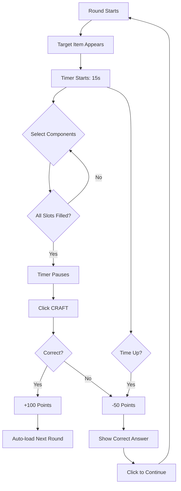

# How to Play Crafter LoL

Crafter LoL is an intuitive quiz game that tests your knowledge of League of Legends item crafting. Here's everything you need to know to become a crafting master.

## Game Objective

Your goal is to correctly identify the component items needed to craft a target League of Legends item within the time limit.

<Info>
  Each correct answer earns you **100 points**, while incorrect answers deduct **50 points** from your score.
</Info>

## Game Interface

The game interface consists of three main areas:

<CardGroup cols={3}>
  <Card title="Game Header" icon="tv">
    Displays your current score, best score, and remaining time
  </Card>
  <Card title="Game Arena" icon="circle-dot">
    Shows the target item (center) and component options (circle around it)
  </Card>
  <Card title="Crafting Panel" icon="box">
    Displays your selected components and the craft button
  </Card>
</CardGroup>

### Visual Layout

The game uses a centered circular layout:

```javascript
// Arena configuration from theme.js:15-24
export const GAME_CONFIG = {
  itemsInCircle: 14,          // Component items arranged in circle
  circleRadius: 270,          // 270px radius from center
  centralItemSize: 120,       // Target item: 120px
  peripheralItemSize: 64,     // Component items: 64px
};
```

## How to Play a Round

<Steps>
  <Step title="Observe the Target Item">
    When a round starts, a target item appears in the center of the screen. This is the item you need to craft.

    ```jsx
    // Target item loaded from backend - App.jsx:36
    const data = await gameService.getRandomItem();
    setGameData(data);
    ```

    <Tip>
      Look at the target item's appearance and name. If you're familiar with League of Legends, you might recognize what components it needs!
    </Tip>
  </Step>

  <Step title="Review the Component Options">
    Around the target item, you'll see 6-14 component items arranged in a circle (depending on difficulty level).

    - **Correct components** are hidden among distractors
    - Items are randomly positioned each round
    - Each item shows its name on hover

    <Note>
      On Hard difficulty, distractor items are deliberately chosen to have similar tags and costs to make the challenge harder!
    </Note>
  </Step>

  <Step title="Select Components">
    Click on the items you think are the correct components:

    ```jsx
    // Item selection logic from App.jsx:77-94
    const handleItemClick = useCallback((item) => {
      if (feedback) return; // Can't select during feedback

      setSelectedItems((prev) => {
        const isInSlots = prev.some((s) => s.id === item.id);

        if (prev.length < requiredSlots) {
          // Has space: always add (allows duplicates)
          return [...prev, item];
        } else if (isInSlots) {
          // Slots full and item already there: remove last occurrence
          const lastIdx = prev.map((s) => s.id).lastIndexOf(item.id);
          return prev.filter((_, i) => i !== lastIdx);
        }
        // Slots full and item not there: do nothing
        return prev;
      });
    }, [feedback, requiredSlots]);
    ```

    **Selection Rules**:
    - Click an item to add it to your crafting slots
    - Click it again to remove it
    - You can select the same item multiple times (some recipes need duplicates!)
    - Slots are filled from left to right

    <Warning>
      Once you've filled all required slots, you cannot select different items unless you first deselect an existing one.
    </Warning>
  </Step>

  <Step title="Watch the Timer">
    You have **15 seconds** (by default) to make your selection:

    ```javascript
    // Timer configuration from theme.js:16
    timePerQuestion: 15, // seconds
    ```

    **Timer Behavior**:
    - Counts down from 15 seconds
    - **Automatically pauses** when all slots are filled
    - Resumes if you deselect an item
    - When time runs out, the round ends automatically

    ```jsx
    // Timer pauses when slots are full - App.jsx:53
    if (selectedItems.length >= requiredSlots) return; // PAUSE
    ```

    <Info>
      The timer pause gives you time to review your selections before crafting!
    </Info>
  </Step>

  <Step title="Submit Your Answer">
    Once you've selected all required components, click the **CRAFT** button:

    ```jsx
    // Submit validation from App.jsx:97-128
    const handleSubmit = useCallback(async () => {
      if (selectedItems.length !== requiredSlots) return;

      const selectedIds = selectedItems.map((item) => item.id);
      const result = await gameService.validateAnswer(
        gameData.targetItem.id, 
        selectedIds
      );

      if (result.isCorrect) {
        const newScore = score + GAME_CONFIG.pointsPerCorrect;
        setScore(newScore);
        storageService.incrementStreak();
        setFeedback({ isCorrect: true, points: 100 });
        setTimeout(() => loadNewQuestion(), 2000);
      } else {
        const newScore = Math.max(0, score - GAME_CONFIG.pointsPerIncorrect);
        setScore(newScore);
        storageService.resetStreak();
        setFeedback({
          isCorrect: false,
          points: 50,
          correctItems: result.correctComponents
        });
      }
    }, [selectedItems, gameData, score]);
    ```

    The button is only enabled when all slots are filled.
  </Step>

  <Step title="Receive Feedback">
    After submitting, you'll see immediate feedback:

    **If Correct** ✓
    - Green success overlay appears
    - +100 points added to your score
    - Streak counter increments
    - New round loads automatically after 2 seconds

    **If Incorrect** ✗
    - Red error overlay appears
    - -50 points deducted (score never goes below 0)
    - Correct components are highlighted
    - Streak counter resets
    - Click anywhere to continue to next round

    <Tip>
      Pay attention to the correct components shown when you're wrong - it's a great learning opportunity!
    </Tip>
  </Step>
</Steps>

## Controls Summary

<Tabs>
  <Tab title="Mouse">
    - **Left Click on Component**: Select/deselect item
    - **Click on Craft Button**: Submit answer
    - **Click on Feedback Overlay**: Continue to next round (after incorrect answer)
  </Tab>
  <Tab title="Touch">
    - **Tap Component**: Select/deselect item
    - **Tap Craft Button**: Submit answer
    - **Tap Feedback Overlay**: Continue to next round
  </Tab>
</Tabs>

## Game Flow Diagram



## Tips for Success

<Accordion title="Know Your Items">
  Familiarize yourself with common League of Legends items and their components:
  
  - **Basic items** (Long Sword, Cloth Armor, etc.) are usually components
  - **Legendary items** (Infinity Edge, etc.) are what you're crafting
  - **Mythic items** may have more complex recipes
</Accordion>

<Accordion title="Use Process of Elimination">
  On harder difficulties, eliminate obviously wrong items first:
  
  - Items with vastly different costs are likely wrong
  - Items with unrelated tags (AP vs AD) are probably not correct
  - Basic starter items are often not used in complex recipes
</Accordion>

<Accordion title="Manage Your Time">
  - Don't rush immediately - you have 15 seconds
  - Use the timer pause feature to review your selections
  - If you're unsure, make your best guess before time runs out
  - Remember: -50 points is better than -0 progress!
</Accordion>

<Accordion title="Learn From Mistakes">
  - Always review the correct answer when you're wrong
  - Look for patterns in crafting recipes
  - Some items appear frequently as components
  - After several rounds, you'll start recognizing common combinations
</Accordion>

## Score Persistence

Your score is automatically saved using browser localStorage:

```jsx
// Score initialization from App.jsx:17-18
const [score, setScore] = useState(storageService.getScore());
const [bestScore, setBestScore] = useState(storageService.getBestScore());
```

<Info>
  Your score persists across browser sessions, but it's stored locally on your device. Clearing browser data will reset your scores.
</Info>

## What's Next?

Now that you know how to play, dive deeper into the game mechanics:

<CardGroup cols={2}>
  <Card title="Game Mechanics" icon="gears" href="/game-guide/game-mechanics">
    Learn how questions are generated and validated
  </Card>
  <Card title="Difficulty Levels" icon="chart-line" href="/game-guide/difficulty-levels">
    Understand the differences between Easy, Medium, and Hard modes
  </Card>
</CardGroup>